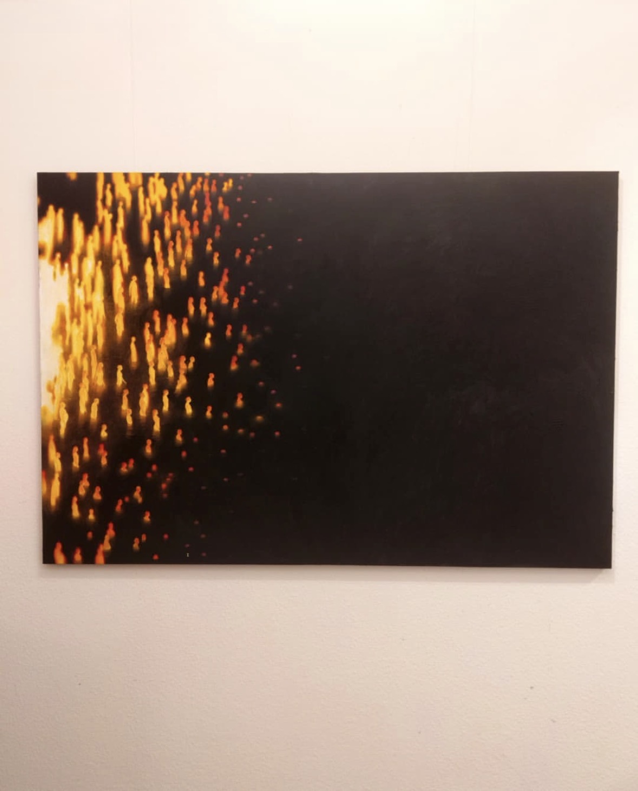
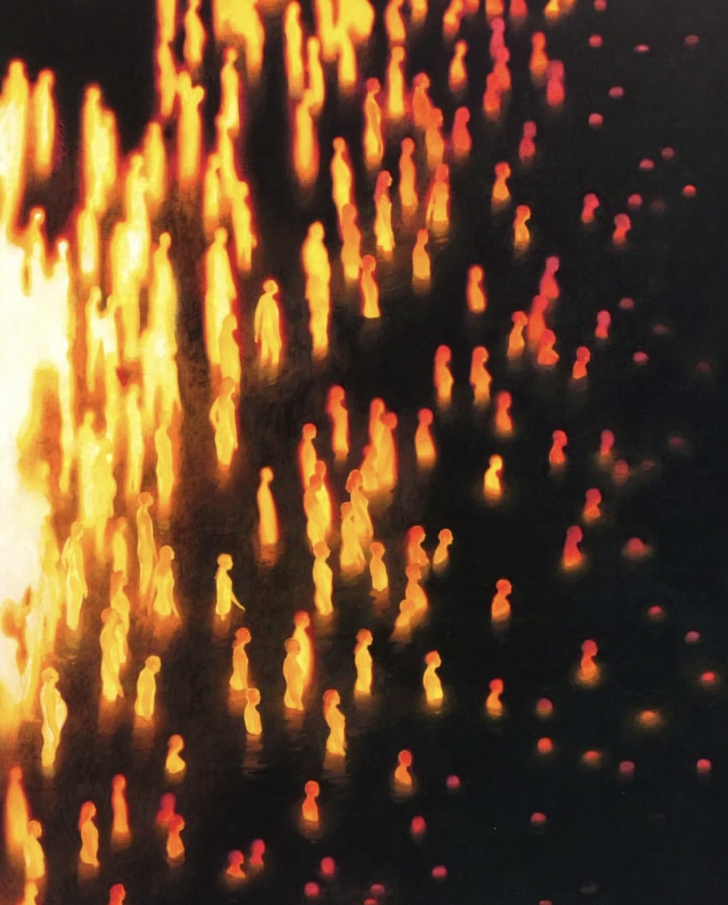
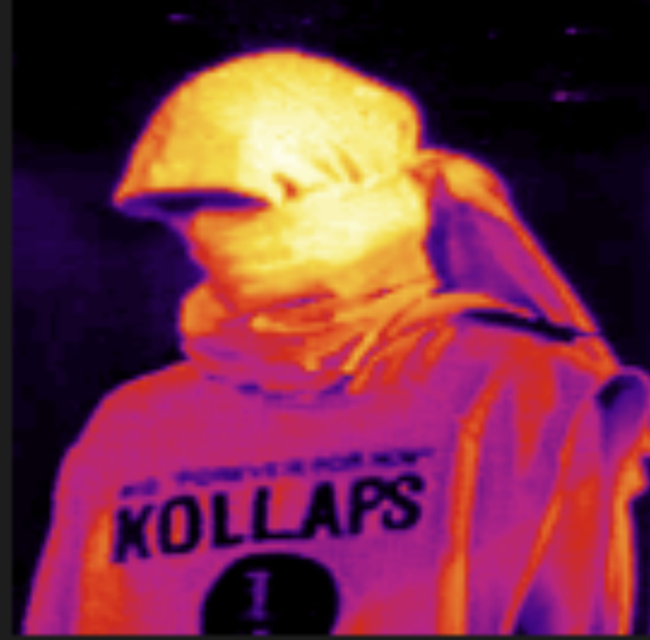

# Quiz 8 
**Student:** Ying Zhang (550096346)
 **Topic:** Thermal Imaging Technique (Design Research)

---

## Part 1: Imaging Technique Inspiration  
**Chosen Technique:** Thermal Imaging — Inspired by Russian artist *Ivan Pokidyshev* (2022, Instagram series)

Ivan Pokidyshev's **thermal-imaging paintings** transform human figures into glowing silhouettes within darkness, using *gradients of red, orange, and yellow* to represent emotion and energy.  
I am inspired by his approach of **replacing physical form with visual heat and movement**, and I aim to integrate this metaphor of *warmth and perception* into my own digital work.  
By visualising **"energy flow"** through colour transitions and luminance, this technique offers a powerful method for expressing *rhythm, emotion, and abstract presence* through code-based visualisation.  

**Example Images:**

| |   |
|:------------------------------------:|:------------------------------------:|
---

## Part 2: Coding Technique Exploration  
**Technique:** *p5.js Pixel-Based Thermal Colour Mapping*  

This coding technique recreates **thermal-imaging visuals** by mapping **pixel brightness** to a **colour gradient** that represents varying heat intensities.  
Using p5.js functions such as **`loadPixels()`** and **`map()`**, it reads each pixel’s brightness and converts it into an index within a custom *heat-colour palette*.  
The resulting colours are blended smoothly with **`lerpColor()`** and redrawn using **`updatePixels()`**.  
It reproduces *thermal-imaging aesthetics* and is **parameterised** (*resolution*, *heat range*, *intensity*), so the same pipeline can later be **animated** while keeping the group code **clean and modular**.  
This process effectively translates *brightness* into **perceived temperature and motion**, generating **glowing gradients** that express *energy, rhythm, and emotion*.  

**Demo Screenshot:**  

  |
|:---------------------------------------------------------:|

**Example Code Link:**  
🔗 [p5.js ThermalView‑effect (GitHub by clod44)](https://github.com/clod44/ThermalView-effect-p5js)

---
